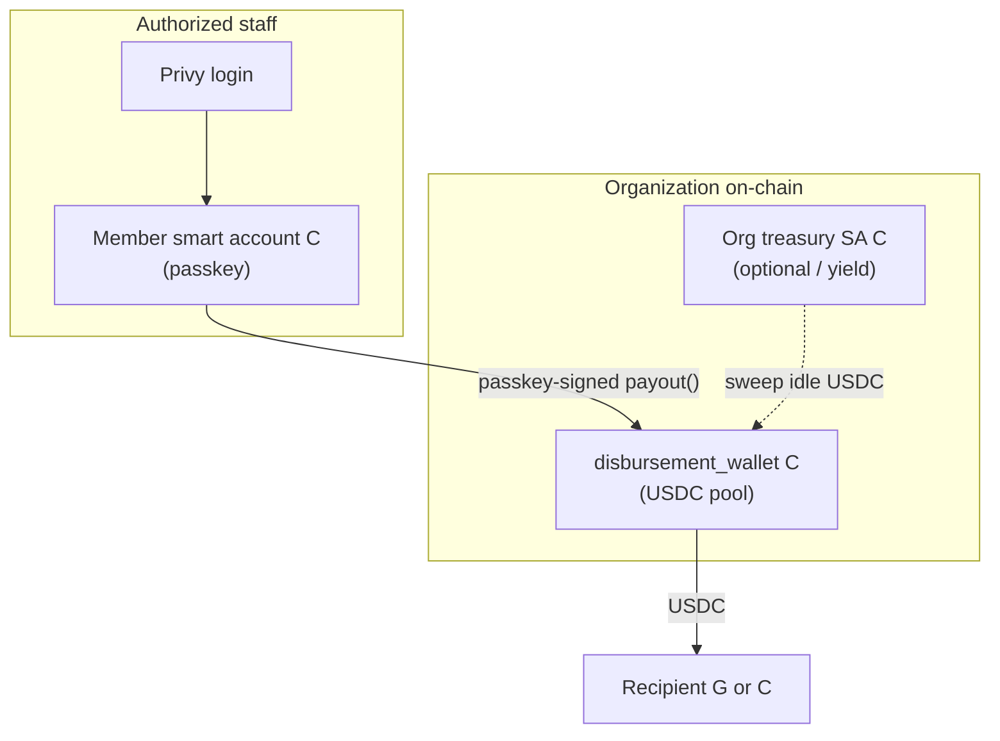

# Org treasury: classic G → smart account (C) migration

## Two wallet concepts (do not conflate)

| Field / table | Address | Role |
|---------------|---------|------|
| `organizations.stellar_disbursement_public_key` | **G…** | Legacy classic org wallet. Auto-provisioned on testnet today. Holds USDC via trustline. Server may hold encrypted secret. |
| `organizations.treasury_contract_id` + `smart_accounts` (`type=org_treasury`) | **C…** | OpenZeppelin **passkey smart account** — org-facing treasury identity (future yield, policy, guardians). |
| `organizations.soroban_contract_id` | **C…** | Custom **`disbursement_wallet`** contract — USDC pool + `payout(caller, recipient, amount)` with on-chain signer whitelist. |
| `smart_accounts` (`type=member`) | **C…** | Staff passkey wallet. **Authorized signer** on the disbursement contract. |

**Target:** USDC lives in the **disbursement contract (C)**. Staff authorize payouts with **member smart accounts (C)** via passkey — not by pasting addresses or unlocking a G secret.

SDP batch disbursements still use SDP’s distribution account for recipient payments; org Soroban treasury is the **policy + on-chain authorization layer** for your org’s funds and internal payouts.

---

## End-state architecture

---

## Migration process (classic G → smart account disbursement)

### Prerequisites

1. Treasury manager (super-admin) is **`allowed`** and has **`admin` / `super_admin`**.
2. Treasury manager completed **member passkey smart wallet** (`/onboarding/setup-smart-wallet`) → `smart_accounts` row with `type=member`.
3. Env configured: `SOROBAN_RPC_URL`, `OZ_*` smart account vars, USDC Soroban token ID (`SOROBAN_USDC_TOKEN_ID` or resolved SAC).
4. Optional: `DISBURSEMENT_WALLET_WASM_HASH` for server-side deploy; otherwise deploy WASM once via Soroban CLI and pass `contractId` to bootstrap API.

### Step 1 — Register org treasury smart account (optional but recommended)

Create the org’s **OpenZeppelin treasury smart account** (passkey, guardians, threshold policy):

1. Super-admin opens **Profile → Organization treasury**.
2. **Create org treasury (passkey)** — same Smart Account Kit flow as member wallet, stored as `smart_accounts.type = org_treasury`.
3. Persist `organizations.treasury_contract_id`.

This account is for org identity, yield routing, and guardian recovery — not required for the minimal disbursement contract path.

### Step 2 — Bootstrap disbursement contract

1. Deploy `contracts/disbursement_wallet` WASM (CLI or dashboard bootstrap API).
2. **`initialize(token, [memberSmartAccountC])`** — first authorized signer is the treasury manager’s **member smart account C address**, not a G key.
3. Save contract ID → `organizations.soroban_contract_id`.

Dashboard: **Profile → Organization treasury → Bootstrap disbursement contract**.

### Step 3 — Fund the contract (migrate USDC from G)

1. Read balance on legacy **`stellar_disbursement_public_key` (G)**.
2. Submit Soroban **token.transfer(G → disbursement_contract, amount)** using server-held org G secret (testnet MVP) or a passkey-signed transfer in production.
3. Mark migration complete; keep G public key for audit only (rotate secret out).

Dashboard: **Migrate USDC from classic wallet**.

### Step 4 — Add more authorized signers

Each additional admin who should sign payouts:

1. Completes **member passkey smart wallet** setup.
2. Existing signer calls **`add_signer(caller, newMemberC)`** (passkey-signed on-chain, or bootstrap signer once).

Verify with contract view **`is_signer(memberC)`**.

### Step 5 — Payouts and batch authorization

| Flow | Signing |
|------|---------|
| **Recipients → Pay now** | `POST /api/payouts/prepare-soroban` → client **`kit.signAndSubmit`** → `POST /api/payouts/submit-signed-soroban` |
| **Batch disbursements → Start** | Passkey policy session (already implemented) + audit; on-chain `payout` optional per batch when wired |

---

## What we stop doing after migration

- Do **not** require copying Stellar addresses between Profile and disbursement forms.
- Do **not** use org G secret for routine payouts (testnet server secret is bootstrap-only).
- Do **not** add staff G keys as disbursement signers — use **member smart account C** only.

---

## Database checklist

| Check | Query / field |
|-------|----------------|
| Member passkey wallet | `smart_accounts` where `user_id` + `type=member` |
| Org treasury SA | `organizations.treasury_contract_id`, `smart_accounts` `type=org_treasury` |
| Disbursement pool | `organizations.soroban_contract_id` |
| Legacy classic (pre-migration) | `organizations.stellar_disbursement_public_key` |
| Signer whitelist | On-chain `is_signer(memberC)` on disbursement contract |

---

## Environment variables

| Variable | Purpose |
|----------|---------|
| `SOROBAN_RPC_URL` | Soroban RPC |
| `SOROBAN_USDC_TOKEN_ID` | USDC SAC contract ID (C…) |
| `DISBURSEMENT_WALLET_WASM_HASH` | Optional server deploy of disbursement WASM |
| `OZ_SMART_ACCOUNT_WASM_HASH_TESTNET` | OZ smart account WASM |
| `OZ_WEBAUTHN_VERIFIER_CONTRACT_ID_TESTNET` | WebAuthn verifier |
| `STELLAR_FUNDER_SECRET` | Pays deploy / bootstrap tx fees |

See [testnet-contracts.md](../02-contracts/testnet-contracts.md) to record deployed addresses.
