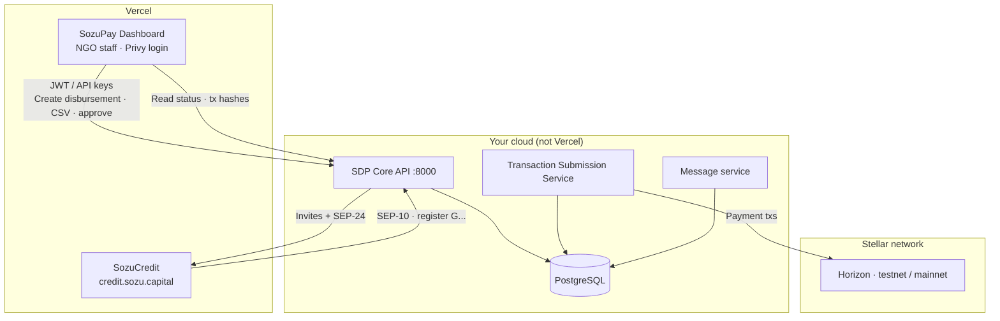

# NGO batch disbursements — SDP + SozuPay Dashboard deployment

**Goal:** NGO staff log into **your** Next.js app (SozuPay Dashboard), create a batch, and pay recipients on **testnet** (later **mainnet**), using the **official Stellar Disbursement Platform (SDP)** under the hood — with **SozuCredit** as the recipient wallet.

---

## Critical clarification: what runs on Vercel vs not

| Component | Technology | Deploy where | In this repo? |
|-----------|------------|--------------|---------------|
| **SozuPay Dashboard** (NGO UI) | Next.js | **Vercel** ✅ | Yes — `src/app`, Privy auth, future SDP API client |
| **SozuCredit** (recipient wallet) | Next.js | **Vercel** ✅ | Separate repo — [SozuCredit](https://github.com/blessedux/SozuCredit) |
| **SDP backend** (API, TSS, jobs, DB) | Go + PostgreSQL + workers | **AWS / GCP / Railway / Fly.io / Docker on VPS** ❌ not Vercel | Submodule-style clone: `stellar-disbursement-platform-backend/` (local dev only) |
| **SDP stock admin UI** (optional) | React static | S3/CloudFront or bundled with SDP | Not required if dashboard replaces it |

**You cannot host the full SDP server on Vercel.** Vercel is serverless/edge — SDP needs a long-running API, transaction submission service (TSS), message workers, and PostgreSQL. Stellar documents SDP as a [self-hosted platform](https://developers.stellar.org/docs/platforms/stellar-disbursement-platform).

**What you *are* building:** SozuPay Dashboard on Vercel as the **official NGO-facing UI** that calls SDP’s **REST API** (same API the stock SDP frontend uses).

---

## Three-layer architecture



| Layer | User | Responsibility |
|-------|------|----------------|
| **1. SozuPay Dashboard** | NGO staff | Login, org context, upload CSV, approve batch, view payment status and tx hashes |
| **2. SDP (hosted by you or partner)** | System | Tenants, wallets, disbursements, SEP-24 verification UI, on-chain payout |
| **3. SozuCredit** | Beneficiary | Signed invite, passkey, `/sdp/register`, receive USDC |

---

## What is already done vs what to build

### Done

- **SozuCredit:** SDP recipient path (invite, TOML, SEP-10/SEP-24, passkeys) on `credit.sozu.capital` (testnet env).
- **SozuPay Dashboard:** Privy auth, org onboarding, dashboard shell; SDP **documentation** and local Docker runbooks.
- **Local dev:** Docker SDP + `bluecorp.stellar.local` + preflight script.

### To build (dashboard ↔ SDP)

| Work item | Description |
|-----------|-------------|
| **SDP API client** | Server-side module in this repo: auth to SDP tenant API, create/list disbursements, upload CSV, start payout, poll payments. |
| **Dashboard UI** | Pages: New disbursement → upload CSV → select wallet (SozuCredit) → approval flow → status + Horizon links. |
| **Env wiring** | `SDP_API_URL`, tenant name, service/API credentials (never in browser). |
| **Hosted SDP** | One testnet deployment; one mainnet deployment when ready. |

Stock SDP frontend (`sdp-frontend` on port 3000 in Docker) is a **reference** — you can retire it for NGOs once the dashboard implements the same API flows.

---

## Step-by-step: deploy for testnet (NGO can disburse)

### Phase A — Recipient wallet (already in progress)

1. **SozuCredit** on Vercel — `credit.sozu.capital`.
2. Env: `SEP10_CLIENT_SIGNING_SECRET`, `WALLET_CLIENT_DOMAIN=credit.sozu.capital`, `SDP_ALLOWED_DOMAINS=<your-sdp-host>`, testnet Stellar vars.
3. Preflight: `./scripts/sdp-preflight.sh credit.sozu.capital`.

### Phase B — Host SDP backend (testnet)

Choose one provider (examples; pick one for MVP):

| Provider | Notes |
|----------|--------|
| **AWS** | Stellar’s common path — ECS/EKS + RDS Postgres ([SDP setup](https://developers.stellar.org/docs/platforms/stellar-disbursement-platform)). |
| **Railway / Render / Fly.io** | Docker Compose or multi-service app + managed Postgres. |
| **Single VPS** | `docker compose` from `stellar-disbursement-platform-backend/dev` adapted for production env files. |

Steps (high level):

1. Provision **PostgreSQL** (admin + tenant DBs per SDP docs).
2. Deploy **sdp-api**, **sdp-tss**, **message service** (and optional **sdp-frontend** for debugging only).
3. Configure **testnet** keys: distribution account, SEP-10 signing, `HORIZON_URL=https://horizon-testnet.stellar.org`.
4. Run migrations / `make setup` equivalent for **one tenant** (e.g. `mujeres2000` or `bluecorp`).
5. Create NGO admin users (email/password or SSO per SDP).
6. **Register SozuCredit wallet** in SDP admin:

   | Field | Value |
   |-------|--------|
   | Name | SozuCredit |
   | SEP-10 client domain | `credit.sozu.capital` |
   | Deep link | `https://credit.sozu.capital/sdp/invite` |

7. Note public **SDP API base URL** (e.g. `https://sdp-testnet.sozu.capital` or tenant host).

**Add partner SDP host to SozuCredit:**  
`SDP_ALLOWED_DOMAINS=credit.sozu.capital:443,<sdp-api-host>` (exact host:port SDP uses in invite `domain` param).

### Phase C — SozuPay Dashboard on Vercel (NGO UI)

1. Deploy **this repo** (`sozupay_mvp`) to Vercel (existing or new project).
2. Add server env (names illustrative — align with your SDP client implementation):

   ```bash
   SDP_API_URL=https://<tenant-host>/          # e.g. https://mujeres2000.sdp.sozu.capital
   SDP_TENANT_NAME=mujeres2000                   # if multi-tenant
   SDP_DASHBOARD_API_KEY=...                    # org API key from SDP
   # Or SDP service user JWT flow per SDP auth docs
   STELLAR_NETWORK=testnet
   ```

3. Implement API routes in dashboard that **proxy** to SDP (keep secrets server-side).
4. NGO flow in UI:
   - Login (Privy) → select org
   - **Disbursements** → upload CSV → choose **SozuCredit** wallet
   - Approval (if enabled) → **Start** disbursement
   - **Payments** table → show `stellar_transaction_id` + link to [Stellar Expert testnet](https://stellar.expert/explorer/testnet)

5. **Do not** embed SDP’s Docker frontend in Vercel — use your Next.js pages only.

### Phase D — End-to-end test (testnet)

1. NGO creates batch in **SozuPay Dashboard** (or SDP admin until UI is built).
2. Recipients get invite → **credit.sozu.capital** → register.
3. SDP pays → collect **two tx hashes** (see [sdp-testnet-production-e2e.md](sdp-testnet-production-e2e.md)).
4. Record evidence for allowlisting / partner review.

### Phase E — Mainnet (later)

Same topology; swap:

- Horizon / network passphrase → **public**
- Distribution account and USDC asset → **mainnet**
- SozuCredit env → `STELLAR_NETWORK=public` (or equivalent)
- Separate SDP deployment or tenant flag for mainnet
- Issuer/anchor allowlist (external)

---

## Local development vs production (summary)

| | Local (your laptop) | Production |
|--|---------------------|------------|
| **NGO UI** | `npm run dev` :3000 | SozuPay Dashboard on Vercel |
| **SDP** | Docker `stellar-disbursement-platform-backend` | Hosted SDP (Phase B) |
| **Wallet** | `credit.sozu.capital` or localhost | `credit.sozu.capital` |
| **Purpose** | Dev + tx hash evidence without cloud SDP | Real NGO operations |

Docker SDP is **not** deployed to production — it **simulates** Phase B on your machine.

---

## Deployment checklist (copy for Notion)

- [ ] Canonical repo: `origin` → `blessedux/sozupay_mvp` ([naming doc](../06-operations/repository-and-naming.md))
- [ ] SozuCredit prod + testnet env on Vercel
- [ ] SDP testnet stack live (API + TSS + Postgres + messages)
- [ ] SozuCredit wallet seeded in SDP
- [ ] `SDP_ALLOWED_DOMAINS` includes hosted SDP host
- [ ] SozuPay Dashboard on Vercel with SDP API env vars
- [ ] Dashboard: create batch → CSV → pay → show tx hashes
- [ ] E2E testnet run with evidence
- [ ] Mainnet duplicate when partner ready

---

## References

- [SDP platform docs](https://developers.stellar.org/docs/platforms/stellar-disbursement-platform)
- [Making your wallet SDP-ready](https://developers.stellar.org/docs/platforms/stellar-disbursement-platform/admin-guide/making-your-wallet-sdp-ready)
- [sdp-readiness.md](sdp-readiness.md) — SozuCredit recipient side
- [sdp-local-e2e.md](sdp-local-e2e.md) — Docker SDP on laptop
- [sdp-testnet-production-e2e.md](sdp-testnet-production-e2e.md) — local SDP + prod wallet
- [repository-and-naming.md](../06-operations/repository-and-naming.md)
