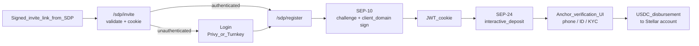

# SDP readiness — SozuPay wallet (snapshot)

**Last updated:** May 2026  
**Status:** Registration path implemented in **SozuCredit** (`credit.sozu.capital`) — the recipient wallet. Production requires env config on SozuCredit and at least one verified E2E with a partner SDP instance.

> **Architecture note:** SozuPay_dashboard is the **NGO operator** side (bulk disbursements, beneficiary management). **SozuCredit** (`credit.sozu.capital`, [`github.com/blessedux/SozuCredit`](https://github.com/blessedux/SozuCredit)) is the **recipient wallet** — where SDP routes, `stellar.toml`, and the registration UI live. All SDP env vars and deep links point to SozuCredit, not the dashboard.

---

## Purpose

The **Stellar Disbursement Platform (SDP)** is the open-source batch-payout stack used by NGOs, aid organizations, and regulated distributors to send USDC (and other Stellar assets) to thousands of recipients. SozuPay functions as the **recipient wallet**: the app a beneficiary opens to complete verification and receive disbursements.

Being "SDP-ready" means recipients can follow a **signed registration link → log in to Sozu → complete Stellar authentication → finish identity verification** on the disbursement operator's side, and then receive payments directly into their Sozu-linked Stellar account.

---

## A note on asset allowlists (ACL)

"ACL" in the disbursement context refers to **who is permitted to originate, move, or settle a regulated asset** such as USDC. That authorization sits with the **asset issuer** (e.g. Circle) and the **anchor** (the operator running SDP for a given program). It is not something the wallet app alone can grant itself.

What Sozu's SDP registration path delivers is the **technical prerequisite**: a standards-based path (SEP-10 + SEP-24) that proves Sozu is a **domain-verified, institution-recognizable wallet**. An issuer or anchor can review our `stellar.toml`, verify our client domain, and decide to place us on their allowlist. The wallet registration and the issuer allowlist are separate gates; this document covers the wallet side.

---

## What is implemented today

The following is live in **SozuCredit** (`credit.sozu.capital`) and ready to run given correct environment variables. The SDP routes in SozuPay_dashboard are superseded; SozuCredit is the correct home for all recipient-facing SDP code.

- **Signed invite entry** (`/sdp/invite`)  
  Validates the deep link signature from the disbursement platform, checks the SDP host against `SDP_ALLOWED_DOMAINS` (SSRF protection), loads `stellar.toml` from that host, stores invite context in a signed **httpOnly** cookie, then redirects to `/sdp/register` (or login with `?sdpInvite=1` if unauthenticated).  
  → `src/app/sdp/invite/route.ts`

- **`/.well-known/stellar.toml` (SEP-0001)**  
  Publishes the wallet's `SIGNING_KEY` from `SEP10_CLIENT_SIGNING_SECRET`. SDP fetches this to validate the client domain before issuing a SEP-10 challenge.  
  → `src/app/.well-known/stellar.toml/route.ts`

- **SEP-10 challenge proxy** (`/api/sdp/sep10/challenge`)  
  Fetches a challenge from SDP's web auth endpoint and validates it with the SDP signing key before returning it to the browser.  
  → `src/app/api/sdp/sep10/challenge/route.ts`, `src/lib/sdp/sep10Server.ts`

- **SEP-10 token exchange** (`/api/sdp/sep10/token`)  
  Receives the user-signed transaction from the browser, adds the **client-domain signature** using `SEP10_CLIENT_SIGNING_SECRET`, submits to SDP, and stores the resulting JWT in a server-side cookie.  
  → `src/app/api/sdp/sep10/token/route.ts`, `src/lib/sdp/sep10Server.ts`

- **SEP-24 interactive deposit** (`/api/sdp/sep24/deposit`)  
  Starts the interactive registration with the SDP anchor (passing the JWT and asset from the invite cookie), then redirects the user to the anchor's own verification UI.  
  → `src/app/api/sdp/sep24/deposit/route.ts`, `src/lib/sdp/sep24Server.ts`

- **SEP-24 transaction status** (`/api/sdp/sep24/transactions`, `/api/sdp/sep24/info`)  
  Polls registration status after the user completes the anchor's verification flow.  
  → `src/app/api/sdp/sep24/transactions/route.ts`, `src/app/api/sdp/sep24/info/route.ts`

- **Registration UI** (`/sdp/register`)  
  Four-step component: SEP-10 sign → trustline check → SEP-24 open → status poll. Auth and middleware redirect unauthenticated users to login before reaching this page.  
  → `src/components/SdpRegisterFlow.tsx`, `src/app/sdp/register/page.tsx`

- **Auth wiring**  
  Both Privy and Turnkey login routes detect a pending invite cookie and redirect to `/sdp/register` automatically after sign-in.  
  → `src/app/api/auth/privy/route.ts`, `src/app/api/auth/turnkey/route.ts`

- **Operator documentation**  
  Checklist for SDP admin seeding (name, homepage, client domain, deep link values); local Docker E2E runbook.  
  → `docs/04-integrations/sdp-wallet-operator-checklist.md`, `docs/04-integrations/sdp-local-e2e.md`

### Signing model

SozuCredit uses **passkey / biometric signing** for SEP-10. The user taps their fingerprint or face ID; the transaction is signed locally using the IndexedDB keypair. No secret key is ever shown or pasted. This uses SozuCredit's existing WebAuthn infrastructure (`/api/wallet/stellar/signing-challenge` + `verify-assertion` + `signTransactionWithPasskeyApproval`).

---

## What is not yet in the product

| Item | Status | Reference |
|------|--------|-----------|
| Passkey / no-secret-key signing on `/sdp/register` | **Done** — SozuCredit uses existing WebAuthn signing | [sdp-passkey-noncustodial-wallet.md](sdp-passkey-noncustodial-wallet.md) |
| Programmatic wallet-provider registration in SDP UI | Planning; requires SDP admin per partner | [30day-sprint-plan.md](../03-planning/30day-sprint-plan.md) |
| SEP-24 withdraw flow | Out of scope unless a partner requires it | — |
| CI-based automated SDP E2E | Optional; mocked contract tests recommended | [sdp-local-e2e.md](sdp-local-e2e.md) |
| Issuer / anchor allowlist placement (ACL) | External partner/issuer decision | — |

---

## End-to-end flow in production

### Narrative

1. The disbursement operator (NGO, aid program, or anchor) creates a payout program in their SDP and configures **SozuCredit** as the wallet (name, `credit.sozu.capital` as client domain, `https://credit.sozu.capital/sdp/invite` as deep link).
2. SDP sends the recipient a **signed registration link** (SMS or email). The link points to `https://credit.sozu.capital/sdp/invite?asset=…&domain=…&name=…&signature=…`.
3. SozuCredit **validates** the signature and domain allowlist, stores invite context in a signed httpOnly cookie, and routes the user to **`/auth?sdpInvite=1`** if not logged in.
4. The user **logs in** with passkey / biometrics (Supabase + WebAuthn). SozuCredit detects the invite cookie and redirects to `/sdp/register`.
5. On `/sdp/register`, SozuCredit fetches a **SEP-10 challenge** from SDP, triggers a **biometric / passkey prompt** to confirm the user, signs the challenge locally using the browser-stored IndexedDB keypair, and adds the **client-domain signature** before exchanging for a **JWT**.
6. SozuCredit uses the JWT to start a **SEP-24 interactive deposit** with the anchor. The user is redirected to the **anchor's verification UI** (phone, ID, or KYC as required by the program).
7. After the anchor marks the recipient verified, **SDP can disburse** USDC to the Stellar account in `stellar_wallets.public_key` for that user.

### Flow diagram

---

## Production readiness checklist

Use this alongside [sdp-wallet-operator-checklist.md](sdp-wallet-operator-checklist.md) when preparing a deployment.

### Environment variables (server-side)

| Variable | Required | What it does |
|----------|----------|--------------|
Set these in **SozuCredit** (`credit.sozu.capital`), not in SozuPay_dashboard.

| Variable | Required | What it does |
|----------|----------|--------------|
| `SDP_ALLOWED_DOMAINS` | Yes | Comma-separated SDP hostnames whose `stellar.toml` SozuCredit may fetch. Include every partner/anchor host. |
| `WALLET_CLIENT_DOMAIN` | Yes | `credit.sozu.capital` in production. Tunnel hostname in local dev. Must match `Host` SDP uses to fetch `stellar.toml`. |
| `SEP10_CLIENT_SIGNING_SECRET` | Yes | Stellar secret key whose public is in `stellar.toml` as `SIGNING_KEY`. Server-only. |
| `AUTH_SECRET` | Yes | Signs the invite cookie. |
| `STELLAR_NETWORK` | Recommended | Set to `public` for mainnet; defaults to testnet passphrase. |
| `NEXT_PUBLIC_APP_URL` | Recommended | Used in `stellar.toml` `DOCUMENTATION` field. |

### Infrastructure

- `/.well-known/stellar.toml` must be reachable by the SDP host over HTTPS. In local dev, use an ngrok tunnel and set `WALLET_CLIENT_DOMAIN` to the tunnel hostname.
- The user's Stellar account on their Sozu profile must exist and have the relevant **trustline** (e.g. USDC) before the disbursement lands.

### Before going live with a partner

- [ ] Complete local Docker E2E per [sdp-local-e2e.md](sdp-local-e2e.md) — invite → login → SEP-10 → SEP-24 verified.
- [ ] Capture evidence: short screen recording + SDP version or commit + client domain + deep link used.
- [ ] Partner SDP admin has seeded Sozu using [sdp-wallet-operator-checklist.md](sdp-wallet-operator-checklist.md).
- [ ] Tested on **testnet** with real SDP instance, then repeated on **mainnet/public** when ready.
- [ ] Issuer/anchor ACL decision tracked separately as an external dependency with the partner.

---

## Related documentation

| Doc | Purpose |
|-----|---------|
| [sdp-wallet-operator-checklist.md](sdp-wallet-operator-checklist.md) | Values to give the SDP admin; env var reference |
| [sdp-local-e2e.md](sdp-local-e2e.md) | Docker SDP local test runbook |
| [sdp-passkey-noncustodial-wallet.md](sdp-passkey-noncustodial-wallet.md) | Future: passkey-gated signing (no secret key exposure) |
| [Stellar: Making Your Wallet SDP-Ready](https://developers.stellar.org/docs/platforms/stellar-disbursement-platform/admin-guide/making-your-wallet-sdp-ready) | Official Stellar documentation |
| [SDP registration API reference](https://developers.stellar.org/docs/platforms/stellar-disbursement-platform/api-reference/registration) | SEP-10 + SEP-24 registration API |
